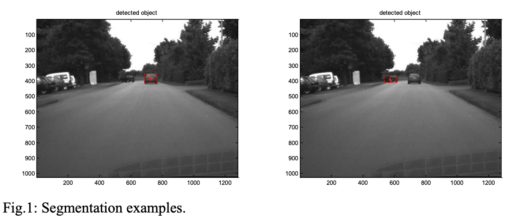
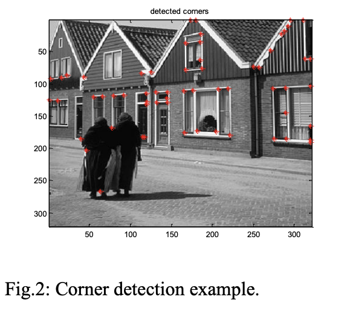

# Computer Vision Exercises 

These are the exercises proposed during the course [Computer Vision](https://corsi.unige.it/en/off.f/2022/ins/60227?codcla=10635) held at [University of Genova (UniGe), Itlay](https://unige.it/en) in [M.Sc Robotics Engineering](https://corsi.unige.it/en/corsi/10635).  

The folder **Lab-02** focused on the methods to add different types of noise, filters and applying Fourier transformation to the sample image. Using MATLAB appropriate approach is applied on the sample image provided during the lab and the changes are observed with the image.

The folder **Lab-05** focuses on Normalized cross-correlation and Harris corner detection. The NCC focuses on keypoints or corners of the image. Harris corner detection focuses on the corner, edge and plane detection.

For ***Lab-02***, **Image filtering and Fourier Transform** below are *requirements* to fulfill the motive of the exercise:

* Add Gaussian (standard deviation=20) and salt & pepper (density=20%) noise to the provided images:
      <ul>
      <li>display the images, the noisy images, and their histograms.</li>
      </ul>
* Remove the noise by using a moving average, a low-pass Gaussian filter and a median filter:
      <ul>
      <li> use two different spatial supports: 3x3 pixels and 7x7 pixels; </li>
      <li> display the filters by using imagesc() and surf(); </li>
      <li> display the resulting images and their histograms. </li>
      </ul>
* Implement the slides 41-45 “practice with linear filters”:
      <ul>
      <li> use filters with a spatial support of 7x7 pixels.</li>
      <li> display the filters by using imagesc() and surf();</li>
      <li> display the resulting images.</li>
      </ul>
* Apply the Fourier Transform (FFT) on the provided images:
       <ul>
      <li> display the magnitude (log) of the transformed images;</li>
      <li> display the magnitude of the transformed low-pass Gaussian filter (spatial support of 101x101 pixels with sigma=5);</li>
      <li> display the magnitude of the transformed sharpening filter, slide 44 (the filter has a spatial support of 7x7 pixels, copy it in the middle of a zeros image of 101x101 pixels).</li>
      </ul>

For ***Lab-05***, below are *requirements* to fulfill the motive of the exercise:

### NCC-based segmentation

* Selecting a window around the red car on the street (in the gray scale image “ur_c_s_03a_01_L_0376.png”) and apply the NCC (normalized cross correlation, normxcorr2), in order to find the template in all the 6 images given during exercise. Showing the template. Showing the position of the maximum of the score map and a box corresponding to the size of the template for all the 6 images (as in Fig.1). Doing the same for the dark car that turns on the left.
* Compare the results of this Lab with the ones of Lab4 (color-based segmentation).
* Consider three different sizes of the window (centered around the dark car that turns on the left): discussing the results in terms of computation time and accuracy of detection.

### Harris corner detection

* Implementing the Harris corner detector. Applying the developed corner detector on the “image i235.png”. Showing the partial derivatives of the image and the Gaussian filter. Showing the R score map and the corner regions. Showing the detected corners overlapped to the image (see Fig.2). 

# Results

For *Lab-02*, [click here](KOHLI_lab02/VATS_KOHLI_LAB02_REPORT.pdf) to reviwe the complete result of this exercise in the report.

For *Lab-05*, [click here](KOHLI_Lab05/Report_Kohli_Vats_lab05.pdf) to reviwe the complete result of this exercise in the report.

